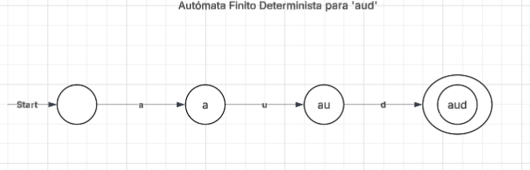
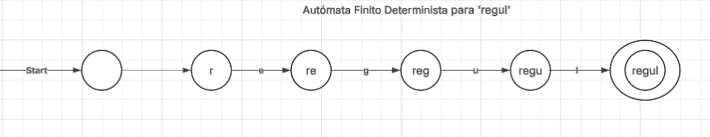

# Analizador Léxico de Palabras Latinas usando DFA

## Descripción

El lenguaje elegido consiste en dos palabras provenientes de las lenguas latinas: “aud” y “regul”.

Tras un análisis superficial, el alfabeto es:

Σ = {a, e, d, g, l, r, u}

La técnica de modelado utilizada es un Autómata Finito Determinista (DFA), ya que es la más práctica para un análisis léxico que involucra símbolos latinos (Hopcroft, Motwani, & Ullman, 2001).

---

## Modelo del Analizador Léxico

Existen dos autómatas para este idioma:

### 1. Autómata para “aud”

El primer autómata representa la palabra “aud”, mostrando la concatenación secuencial de los símbolos:

## Autómata para “aud”

### 2. Autómata para “regul”

El segundo autómata representa la palabra “regul”, mostrando igualmente la concatenación secuencial de los símbolos:

## Autómata para “regul”

Estos dos autómatas son suficientes para este contexto; son capaces de determinar el idioma en cuestión, así como el alfabeto relevante.

### Expresiones Regulares Equivalentes

Conversión de DFA a Expresión Regular:

* DFA → RE 1: `(aud)+`
* DFA → RE 2: `(regul)+`

---

## Implementación

Según las expresiones regulares definidas en `regexp_latin.ipynb` y la función `regex_latin_word_identifier`, se puede realizar una búsqueda para identificar el idioma.

A través de una frase o texto que contenga latín como entrada, el programa determinará si dicho texto contiene una o ambas palabras.

### Ejemplos

"Discipuli regulam audiunt" → Aprobada

"Postea regulam novam audimus et meminimus." → Aprobada

"Regula123 audiunt456" → Reprobada

---

## Pruebas

El archivo `regexp_latin.ipynb` contiene 20 casos de prueba utilizando las expresiones regulares definidas para validar el correcto funcionamiento del analizador léxico.

## Análisis de Tiempo

La complejidad de mi modelo (`regex_latin_word_identifier`) es de eficiencia asintótica lineal \(O(n)\) (Levitin, 2012), donde \(n\) es la longitud de la cadena ingresada. 

Según el plan general en (Levitin,2012,p.62) para un análisis de complejidad, resulta:

\[
C(n) = \sum_{i=1}^{n-1} 1 = n
\]

Esto articula la eficiencia del autómata que modela el reconocimiento de este alfabeto.

Se utilizó la biblioteca `re` o `regex`, instalada a través de **Anaconda Navigator**. El uso de expresiones regulares permite alcanzar una alta velocidad para cumplir con la meta de reconocer el alfabeto en cuestión.

Una solución alternativa sería utilizar bucles anidados donde se considere cada elemento de la cadena introducida. Sin embargo, este enfoque resultaría computacionalmente más costoso, con complejidades aproximadas de \(O(n^2)\) o incluso \(O(n^3)\).

## Referencias

Hopcroft, J. E., Motwani, R., & Ullman, J. D. (2001). *Introduction to automata theory, languages, and computation* (2nd ed.). Addison-Wesley.

Levitin, A. (2012). *Introduction to the design and analysis of algorithms* (3rd ed.). Pearson Education.
